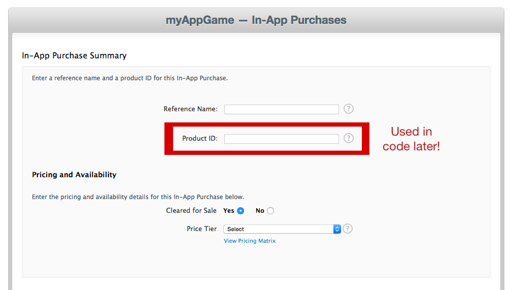
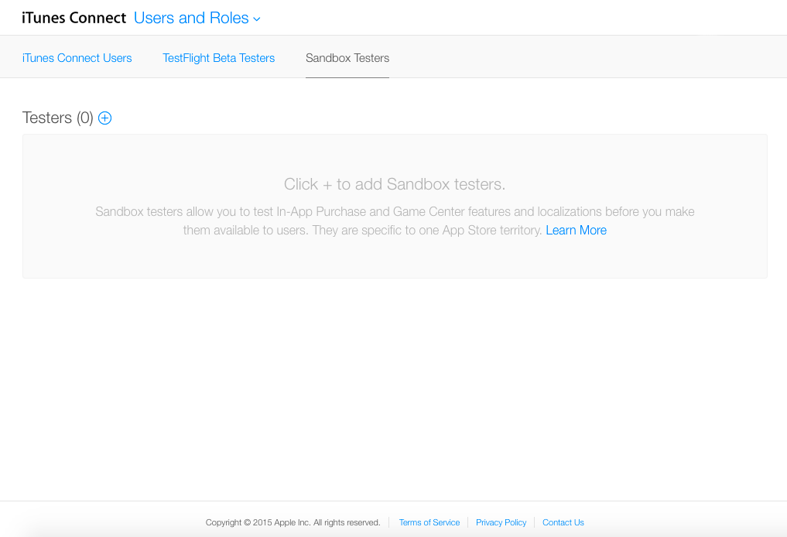
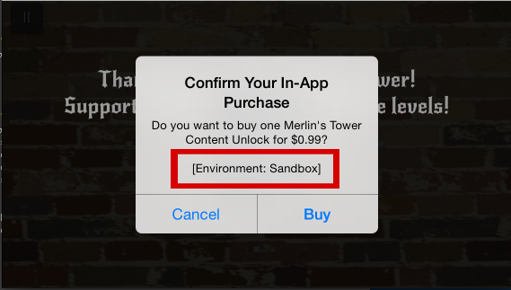

As your product nears readiness for the App Store, the thought may have crossed your mind to try to make some money off your app or game. There are two main mechanisms to do this: up front purchase cost and in app purchases. Up front purchase will ensure that you make some money with each download, but vastly decreases download count. It's much more common (and profitable) to make the download free, but offer things to buy once the user is engaged with the product. This tutorial will walk through the steps required to add an in app purchase, or IAP, to your app or game. We will start with a couple assumptions: you already have an Apple developer account and the app is already added to your developer account in iTunes Connect. The first step is documenting the purchase in iTunes Connect.

#Getting Started

Sign on to iTunes Connect and navigate to "My Apps," select the app that you want to add the IAP to. You should see something similar to this:

Navigate to the In-App Purchase tab and create a new IAP. Now its time to choose what kind of IAP your product will offer. Apple provides five different IAP options, grouped into subscription and consumable types. You will probably choose the one of the consumable types, and it is important to know the difference.

Consumable purchases provide a benefit once, say some extra coins to spend.  Non-Consumable purchase provide a permanent benefit, like unlocking a new character.  Consumable purchases cannot be restored. Non-consumable purchases can be restored, and Apple requires an app to allow customers to restore these purchases.  Regardless of the option you choose, the information required is similar across all types.

Once you select the type of purchase, you will need to complete the form describing the product you want to offer.  You will need to provide some unique identifiers for the product, the price, a customer facing name for the product and a relevant screenshot.  The important field that will be used later is the _Product ID_ field.  This is the string we will use in code to look up the product and offer it to the customer. Save the form and keep that Product ID handy.

Follow the video instructions in the first 5:30 minutes of this [video](https://www.youtube.com/watch?v=h1gQklbrgjc) to setup your In App Purchase on iTunes Connect and on developer.apple.com.

#Write the Code

Next, find the simplified, commented demo project [here]() as an example.

The first step we take to implument IAP is to enable them. Within your Xcode project navigate to the "Capabilities" tab, located right next to the General tab where you would set your BundleID, there, scroll down and turn In-App-Purchases ON.

In your project, ensure to declare the following varialbes:

        //Variables
        //Change this to the start of your own bundleID (the full bundelID of the demo project is com.cliffweitzman.inAppPurchase)
        var identifire = "com.cliffweitzman"

        //Varialbe to keep instance of product
        var p = SKProduct()

        //Products list, which will be populated from apple's server at viewDidLoad
        var list = [SKProduct]()

Next, in your view did load we implument this code:

        //Set up for IAP (In App Purchase) connection with app store
        if(SKPaymentQueue.canMakePayments()) {
        //Put the available products in the Set
        let productID:NSSet = NSSet(objects: "\(identifire).addcoins", "\(identifire).removeads")
        let request: SKProductsRequest = SKProductsRequest(productIdentifiers: productID as! Set<String>)

        request.delegate = self
        request.start()

        print("IAP is enabled, loading")

        //Check at the beginnig of every sessions if purchases were already made. If so, automaticaly restore them. Comment out as needed for testing.
        //            SKPaymentQueue.defaultQueue().addTransactionObserver(self)
        //            SKPaymentQueue.defaultQueue().restoreCompletedTransactions()

        } else {
        print("please enable IAPS")
        }

Here we establish the connection with Apple's server to pull down the available products to purchase. When naming your products, it is advisable to name them according to the convention "com.companyname.productname" In the demo project's case we have two available products, addcoins and removeads. The full name of these products for the demo project on Apple's server is "com.cliffweitzman.addcoins" and "com.cliffweitzman.removads" both of these products re pulled down and places in our set. and then we set the connection with apple. When you'r project loads,' you may want to setup automatic checking to see if purchses have been made in the past and automaticaly restore them if so. For now, we can leave that section commented out so we can better test. 

Next, setup product requests function:
        //Gets called from viewDidLoad when the request variable is assigned. Pulls down product information from apple server.
        func productsRequest(_ request: SKProductsRequest, didReceive response: SKProductsResponse) {
            let myProduct = response.products

            for product in myProduct {
            //Product instances that we got from the Apple server are added to our list and can be accessed when a purchase is attempted:
            list.append(product)
            print("product added")
            }
        }

Setup buttons: 

        //Non-Consumable purchase
        @IBAction func removeAds(_ sender: UIButton) {
            //Get relevant product from the list of available purchases
            for product in list {
                let prodID = product.productIdentifier
                if(prodID == "\(identifire).removeads") {
                    p = product
                    buyProduct()
                    //once we find our product there is no reason to keep ittorating through the list so we break
                    break
                }
            }
        }

        
        //Consumable purchase
        @IBAction func addCoins(_ sender: UIButton) {
            for product in list {
                let prodID = product.productIdentifier
                if(prodID == "\(identifire).addcoins") {
                    p = product
                    buyProduct()
                    break
                }
            }
        }

Setting up making payments. Make sure to change "\(identifire).removeads" and "\(identifire).addcoins" to match whatever your in app purcahses are called. It is also okay to have only one in app purchase. In which case you only need one if block.

        //Payment Queue - where we make a payment
        func paymentQueue(_ queue: SKPaymentQueue, updatedTransactions transactions: [SKPaymentTransaction]) {
            for transaction:AnyObject in transactions {
                let trans = transaction as! SKPaymentTransaction
                print(trans.error)

                if trans.transactionState == .purchased {
                    print("Purchase successful. Unlock IAP here.")
                    let prodID = p.productIdentifier as String

                    if prodID == "\(identifire).removeads" {
                        print("removing ads")
                        adLabel.removeFromSuperview()

                    } else if prodID == "\(identifire).addcoins" {
                        print("adding coins")
                        coins = coins + 50
                        coinLabel.text = "\(coins)"
                    }

                    queue.finishTransaction(trans)
                }
            }
        }

        func paymentQueue(_ queue: SKPaymentQueue, removedTransactions transactions: [SKPaymentTransaction]){
            print("remove trans")
        }

        func finishTransaction(_ trans:SKPaymentTransaction){
            print("finish trans")
            SKPaymentQueue.default().finishTransaction(trans)
        }

        func buyProduct() {
            let payment = SKPayment(product: p)
            SKPaymentQueue.default().add(self)
            SKPaymentQueue.default().add(payment as SKPayment)
            print("\(p.productIdentifier) successfully purchased")
        }

When you setup In App Purchasing you must give the user the ability to restore purchases. To do so, implement the follwoing methods. Once again, make sure to adjust the product names to those you gave your products:

        //Restore purchases - required for app sotre approval
        @IBAction func RestorePurchases(_ sender: UIButton) {
            SKPaymentQueue.default().add(self)
            SKPaymentQueue.default().restoreCompletedTransactions()
        }

        func paymentQueueRestoreCompletedTransactionsFinished(_ queue: SKPaymentQueue) {
            print("transactions restored")

            for transaction in queue.transactions {
                let t: SKPaymentTransaction = transaction

                let prodID = t.payment.productIdentifier as String

                if prodID == "\(identifire).removeads" {
                    print("removing ads")
                    adLabel.removeFromSuperview()

                } else if prodID == "\(identifire).addcoins" {
                    print("adding coins")
                    coins = coins + 50
                    coinLabel.text = "\(coins)"
                }
            }
        }

For further reading on IAPs, checkout
[Apple's StoreKit](https://developer.apple.com/library/mac/documentation/StoreKit/Reference/StoreKit_Collection/) framework to fetch information, request and then execute purchases.
[Delegate](https://developer.apple.com/library/mac/documentation/General/Conceptual/DevPedia-CocoaCore/Delegation.html)
[Protocol](https://developer.apple.com/library/mac/documentation/General/Conceptual/DevPedia-CocoaCore/Protocol.html#//apple_ref/doc/uid/TP40008195-CH45-SW1) 

#Testing

In order to test implemeneted IAPs, you need to create a Sandbox Tester account to perform test purchases.  This is a simple process done in iTunes Connect.  Sign back in to iTunes Connect and navigate to "Users and Roles".  Select the "Sandbox Testers" tab, which will land you at something like this:

Follow the directions to start creating a new tester.  You will need to provide some basic information to create the account. Once the account is created, you will need to sign on to the device you are testing with the sandbox account you created.  You can then go ahead and attempt the purchase with the sandbox account.  The purchase dialog will let you know you are in the sandbox:

You will get the appropriate responses back from Apple so you can verify the purchases work without being charged.  Now that you have created the IAP, implemented the transaction and tested the process it's time to finish up the app and ship it to the App Store.

#Summary

Apple provides the StoreKit framework to let customers buy products while inside a running app.  It is a multi-step process to perform the IAP: register the purchase in iTunes Connect, use the *SKProductsRequest* class to lookup the product, then initiate the transaction with the *SKPaymentQueue*.  To test the IAP while in development, a sandbox tester account is required.  This kind of account can be created in iTunes Connect.  If you choose to have non-consumable purchases, you **must** provide a way for customers to restore purchases.  **Apple will not approve an app that does not provide this**.  Now you have the tools needed to further monetize your app.  Happy coding!
